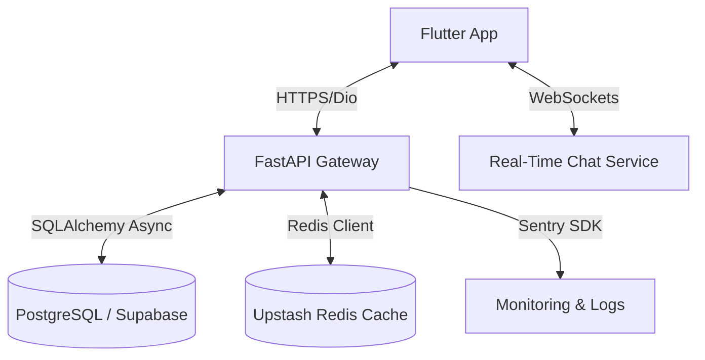

<p align="center">
  
</p>

<h1 align="center">MAMBO</h1>
<p align="center"><strong>The Ultimate Social Universe & Cinema DNA Tracker for Cinephiles</strong></p>

<p align="center">
  <a href="https://mambo-app-co.vercel.app/"><strong>Live Landing Page ➔</strong></a> | 
  <a href="https://github.com/lakshchawla28/MAMBO/raw/main/mambo.v1.0.2.apk"><strong>Download Android APK ➔</strong></a>
</p>

---

## 🎬 What is MAMBO?

Stop switching between IMDb, Letterboxd, MyAnimeList, and chat apps. **MAMBO** is a unified social platform specifically engineered for movie, TV series, and anime lovers. It fuses media tracking, social reviews, curated lists, and direct communication into a single, high-fidelity application built on a premium, dark-mode glassmorphic user interface.

With MAMBO, you don't just log what you watch—you build your **Cinema DNA**, review titles with precision, recommend gems directly to your inner circle, and explore new horizons across all cinematic mediums.

<p align="center">
  
</p>

---

## 🌟 Enhanced Feature Set

### 🎭 Mood-Based UI Environments
MAMBO adapts to what you are watching. Toggling modes shifts the entire application’s aesthetic, color palettes, and gradients:
*   🎬 **Movie Mode:** Elegant, deep gold and obsidian theme inspired by the classic theater experience.
*   💙 **Series Mode:** Calm, royal blue and dark indigo gradient shifts designed for high-density information and long binge sessions.
*   🔥 **Anime Mode:** Explosive fire-orange and neon pink gradients matching the energetic pacing of anime.

### 📊 Cinema DNA Tracker & Stats (MAMBO Wrapped)
Your taste, quantified. The stats dashboard analyzes your watch history in real-time to generate a Letterboxd-style statistical analysis:
*   **Total Minutes Watched:** Breakdown of total watch time across movies, series, and anime.
*   **Aesthetic Balance:** Interactive charts visualizing your genre affinity and medium distribution.
*   **Cinematic Records:** Showcase your top-rated directors, actors, and monthly watching spikes.
*   **Wrapped Cards:** Share custom-generated statistical summaries of your year or month in cinema.

### 📱 Swipe-to-Discover Feed
Browse trending lists, highly anticipated releases, and personalized recommendations with a fluid swipe-up vertical feed.
*   **Anticipated Tab:** View calendar dates for upcoming blockbusters and seasons.
*   **Interest Toggle:** Mark upcoming content as "Interested" to receive launch notifications and auto-add them to your watchlist.

### 📝 Rate, Review & Recommend
*   **Log Entries:** Log titles with custom dates, specific watch settings (rewatch, theater, platform), and half-star scoring (0.5 to 5.0).
*   **Deep Reviews:** Post thoughts in markdown formatting, start discussion threads on specific episodes, and tag friends.
*   **Direct Recommendations:** Send a title straight to a friend's recommendation inbox with a personalized note, bypassing algorithms.

### 📂 Collections & Watchlists
*   **Universal Watchlist:** Keep track of what you intend to watch.
*   **Custom Playlists:** Create collections like *"Mind-bending Sci-Fi"*, *"Comfort Anime"*, or *"Nolan Masterpieces"* and share them with the community.

### ✉️ Real-Time Social Chat
*   Discuss releases in dedicated WebSocket-backed group chats or private DMs.
*   Directly embed movie cards, custom review reviews, or your current watch activity inside the chat interface.

---

## 🛠️ Tech Stack & Architecture

MAMBO is built with a decoupled client-server architecture designed for high availability and low latency.



### 📱 Mobile App (Frontend)
*   **Core:** Flutter SDK & Dart
*   **State Management:** Riverpod (`flutter_riverpod`)
*   **Navigation:** GoRouter (with custom transition physics)
*   **Local Caching:** Hive DB & Shared Preferences
*   **Animations:** Flutter Animate (`flutter_animate`) & Hero transitions
*   **HTTP Client:** Dio (configured with retry interceptors & JWT refresh handlers)

### ⚙️ Backend Services
*   **Framework:** FastAPI (Python 3.10+) & Uvicorn ASGI Server
*   **Database:** PostgreSQL hosted on Supabase (using SQLAlchemy async ORM)
*   **Caching & Rate Limiting:** Upstash Redis (preventing API scraping and token abuse)
*   **Error Monitoring:** Sentry SDK Integration
*   **Authentication:** Firebase Admin SDK & PyJWT (Google OAuth verified)
*   **Cron Schedulers:** Automated background workers for clearing expired cache, database data healing, and cinematic news scraping (using BeautifulSoup4).

---

## 🗂️ Backend API Gateway Overview

The FastAPI backend uses structured versioning (`/v1`) with modular route files:

| Route Path | Description |
| :--- | :--- |
| `/v1/auth` | Firebase OAuth token exchange, JWT generation, and session validation. |
| `/v1/users` | Handles profiles, connection requests, and user privacy settings. |
| `/v1/reviews` | Create, read, update, and delete reviews (with support for half-star ratings). |
| `/v1/posts` | Social feed management: timeline assembly, image uploads, and post interactions. |
| `/v1/feed` | Algorithmic and chronological activity streams of followed users. |
| `/v1/discover` | Swipe-up content generator showcasing trending movies, series, and anime. |
| `/v1/content` | Content metadata retrieval, poster fetches, and streaming details. |
| `/v1/collections` | Create, edit, and query user-curated lists and watchlists. |
| `/v1/recommendations` | Handles peer-to-peer sharing and content suggestion engines. |
| `/v1/chat` | WebSocket endpoints for low-latency direct and group messaging. |
| `/v1/notifications` | Triggers, clears, and reads in-app and push notification states. |
| `/v1/news` | Aggregates and serves verified pop-culture and cinematic news. |

---

## 💻 Local Development Setup

To run MAMBO locally in your development environment, follow these steps:

### Prerequisites
*   [Flutter SDK](https://docs.flutter.dev/get-started/install) (v3.0.0 or higher)
*   [Python](https://www.python.org/downloads/) (v3.10 or higher)
*   [Node.js](https://nodejs.org/) (for the Landing Page website)
*   Supabase Account & Firebase Project for Auth configurations.

---

### 1. Backend Server Setup
1.  Navigate to the backend directory:
    ```bash
    cd mambo-backend
    ```
2.  Create a virtual environment and activate it:
    ```bash
    python -m venv venv
    # On Windows:
    .\venv\Scripts\activate
    # On macOS/Linux:
    source venv/bin/activate
    ```
3.  Install dependencies:
    ```bash
    pip install -r requirements.txt
    ```
4.  Configure your environment variables by copying `.env.example` to `.env` and updating the values:
    ```bash
    cp .env.example .env
    ```
5.  Start the FastAPI local development server:
    ```bash
    uvicorn app.main:app --reload
    ```
    *The API will be available at `http://127.0.0.1:8000` with interactive Swagger docs at `http://127.0.0.1:8000/docs`.*

---

### 2. Flutter Mobile App Setup
1.  Navigate to the mobile app directory:
    ```bash
    cd mambo_app
    ```
2.  Install Flutter packages:
    ```bash
    flutter pub get
    ```
3.  Generate the required code-generation models (Freezed, JSON Serializers):
    ```bash
    dart run build_runner build --delete-conflicting-outputs
    ```
4.  Connect an Android emulator or device, and launch the app:
    ```bash
    flutter run
    ```

---

### 3. Landing Page Website Setup
1.  Navigate to the website directory:
    ```bash
    cd mambo_website
    ```
2.  Install dependencies:
    ```bash
    npm install
    ```
3.  Launch the local dev server:
    ```bash
    npm run dev
    ```
4.  Build the production distribution:
    ```bash
    npm run build
    ```

---

## 📲 APK Installation Guide (Android)

1.  Download the latest compiled release build directly from this repo: **[mambo.v1.0.2.apk](./mambo.v1.0.2.apk)**.
2.  Transfer the file to your Android device (or download it directly from the phone).
3.  Locate the `.apk` file in your device's file manager and click it.
4.  If prompted, enable "Install from Unknown Sources" or "Allow from this source" in your settings.
5.  Open **MAMBO**, sign in securely with your Google account, and start crafting your Cinema DNA!

---

## 🧑‍💻 Creator & Admin

*   **Laksh Chawla** - *Founder & Lead Architect*
    *   [LinkedIn Profile](https://linkedin.com/in/laksh-chawla-1135b7280)
    *   [GitHub Profile](https://github.com/lakshchawla28)
